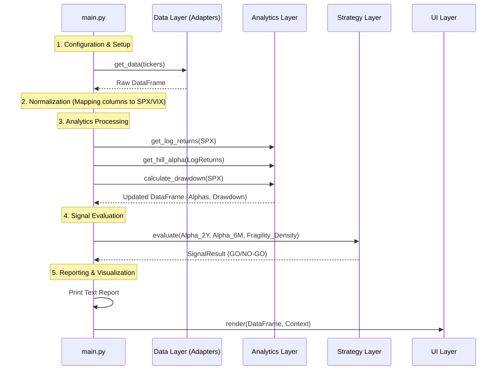

# Architecture Documentation

## 1. Overview

Project Extremistan is a quantitative analysis tool designed to detect "Black Swan" risks in financial markets using Tail Index estimation.

## 2. Current State (Modular Package)

The system is implemented as a structured Python package under `src/extremistan/`.

### 2.1 Package Structure

*   **`data/` (Data Layer)**
    *   `adapters.py`: Contains `YahooFinanceAdapter` and `CSVAdapter`. Both return Pandas DataFrames.
    *   `store.py`: Handles local caching using Parquet files.
    *   `interfaces.py`: Defines the `DataSource` protocol.

*   **`analytics/` (Analytics Engine)**
    *   `math_lib.py`: Pure functions for financial mathematics (Log Returns, Hill Estimator, Drawdown).

*   **`strategy/` (Strategy Layer)**
    *   `signal_engine.py`: Contains `SignalEngine` class. Evaluates "Climate vs. Weather" logic and returns a `SignalResult` (GO/NO-GO).

*   **`ui/` (Presentation Layer)**
    *   `dashboard.py`: Contains `MatplotlibDashboard`. Renders the 4-Track visualization.

*   **`main.py` (Orchestration)**
    *   The entry point of the application. Handles configuration, data normalization, and orchestrates the flow between modules.

### 2.2 Component Interaction

The following diagram illustrates the data flow managed by `main.py`:

### 2.3 Remaining Monolithic Coupling

While the code is physically modular, `main.py` retains significant logic that belongs in specific layers:

1.  **Normalization Logic:** `main.py` manually maps columns (e.g., checks for `^GSPC`, `Close`, or `SPX`) and handles `NaN` values for VIX. This logic is tightly coupled to specific data sources.
2.  **Orchestration Overload:** The script linearizes the entire process. There is no `Application` class wrapping the lifecycle.
3.  **Reporting:** Text-based output is printed directly to `stdout` within `main.py`, making it hard to redirect or format differently (e.g., export to PDF).

---

## 3. Next Steps (Target Architecture)

To further decouple the system, the following refactoring steps are proposed:

1.  **Move Normalization:** Push the column mapping and cleaning logic into a `DataTransformer` or within specific `Adapters` in the Data Layer. The Data Layer should return a standardized schema (guaranteed `SPX`, `VIX` columns).
2.  **Dedicated Orchestrator:** Create an `Engine` or `App` class in a new core module to encapsulate the execution flow, making `main.py` a thin CLI wrapper.
3.  **Decouple Reporting:** Create a `TextReporter` in the UI layer to handle the "Operational Briefing" output, separating presentation from logic.
